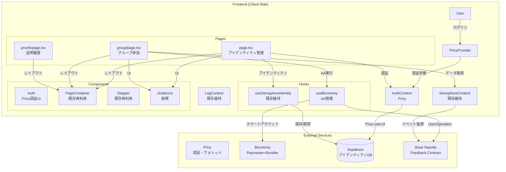
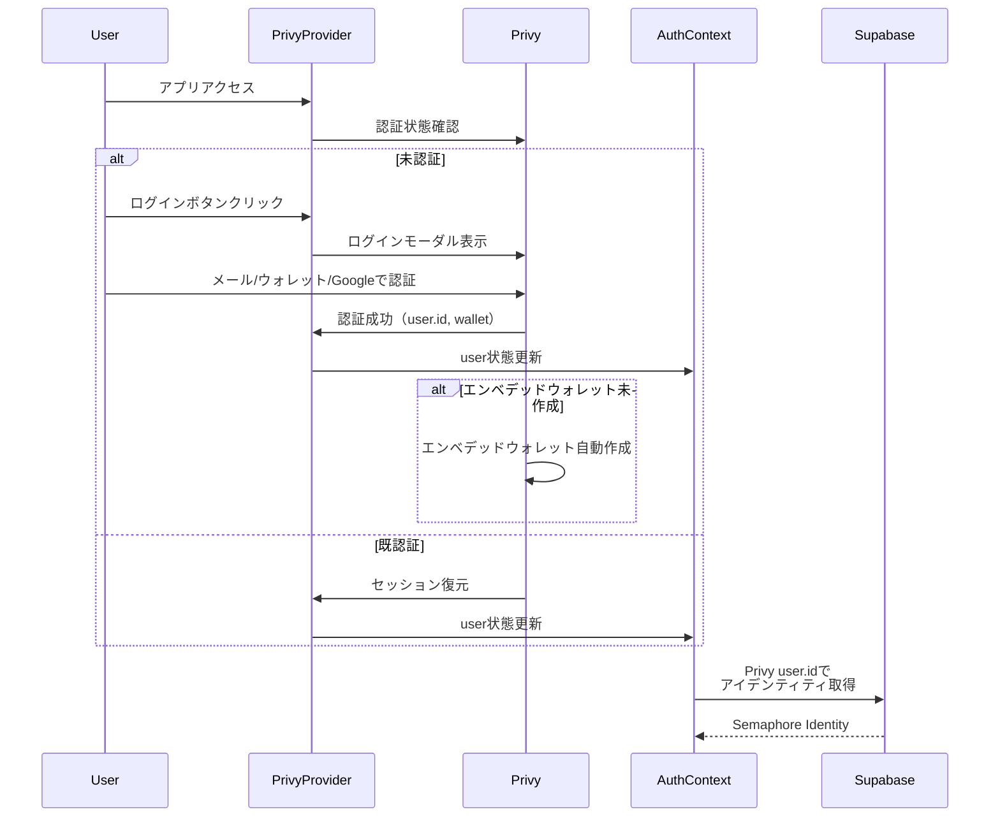
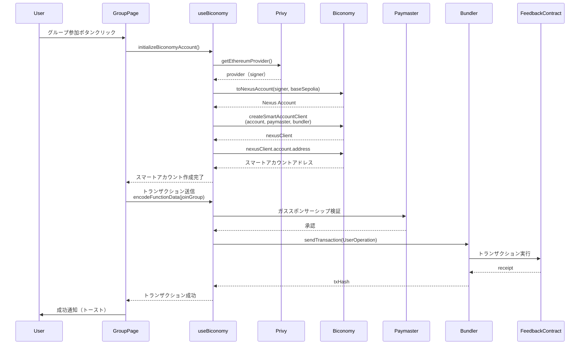
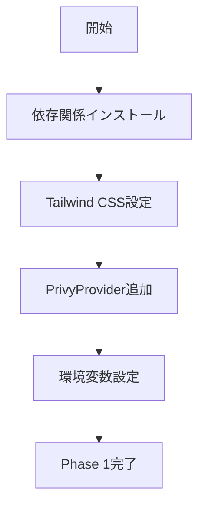
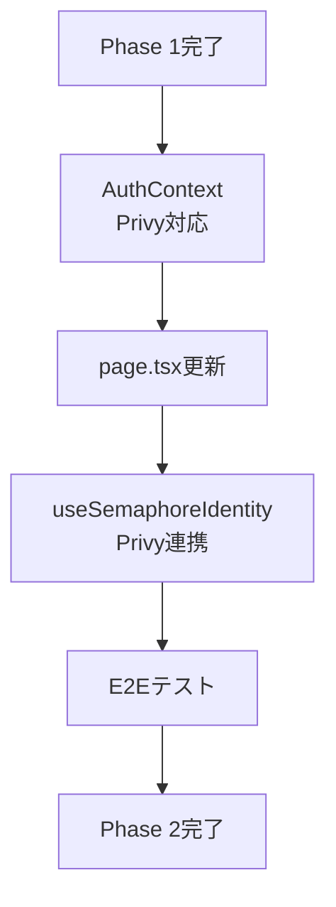
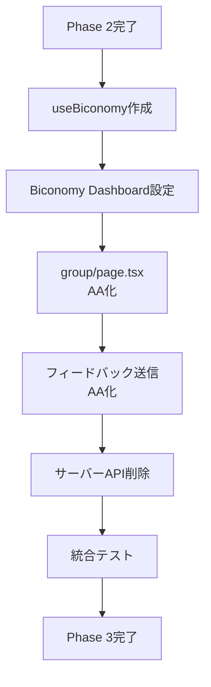
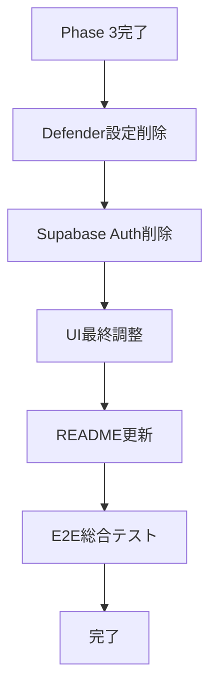

# 技術設計書: AA Gasless Integration

## Overview

本機能は、Semaphore-Sample web-appにおいて、現行のサーバーサイドトランザクション送信（PRIVATE_KEY使用）から、Privy認証 + Biconomy Account Abstraction（AA）によるクライアントサイドガスレストランザクションへ完全移行することを目的とする。

OpenZeppelin Defenderは実際には未使用であり（環境変数のみ設定）、真の移行対象はサーバーサイドAPIからクライアントサイドAA実装への転換である。aa-gasless-sampleのリファレンス実装パターンを活用しつつ、既存のSemaphoreContext、Feedbackコントラクト（Base Sepolia: 0x521a4A2D9A6542A1a578ecF362B8CBeE4Ef46e02）との統合を維持し、ユーザー体験を最高水準に引き上げる。

**ユーザー**: Semaphoreプロトコルを用いた匿名フィードバック送信を行うエンドユーザー。Privy経由でログインし、ガス代を支払うことなくフィードバックをブロックチェーンに送信できる。

**Impact**: サーバーサイドAPI（`/api/join`、`/api/feedback`）を削除し、クライアントサイドでBiconomyスマートアカウント経由のトランザクション送信に置き換える。これにより、ユーザーは即座のトランザクションフィードバックを得られ、サーバー側の秘密鍵管理が不要となる。

### Goals
- Privy認証によるWeb2ライクな認証体験の実現
- Biconomyスマートアカウントによるガスレストランザクションの実装
- 既存Feedbackコントラクト（Base Sepolia）との互換性維持
- サーバーサイドAPI削除によるセキュリティ向上
- UI/UXの現代化（Tailwind CSS + shadcn/ui）
- 既存SemaphoreContext、アイデンティティ管理との統合

### Non-Goals
- Feedbackコントラクトの変更・再デプロイ
- Semaphoreプロトコル自体の変更
- 既存ユーザーデータの移行（Supabaseアイデンティティストレージ継続使用）
- 本番環境への即座のデプロイ（Base Sepolia テストネット限定）
- メインネット（Base）対応（将来拡張で対応）

## Architecture

### Existing Architecture Analysis

**現行アーキテクチャ**:
- **認証**: Supabase Auth（メール認証）によるユーザー管理
- **アイデンティティ**: Semaphore Identityの秘密鍵をSupabase `identities`テーブルに保存
- **トランザクション送信**: クライアント → サーバーAPI（`/api/join`、`/api/feedback`） → ethers.js（PRIVATE_KEY使用） → ブロックチェーン
- **UI**: カスタムCSS、PageContainer、Stepperコンポーネント
- **データ管理**: SemaphoreContext（React Context）でグループメンバーとフィードバックリストを管理

**既存パターンの維持**:
- SemaphoreContext: グループメンバーとフィードバックの状態管理（継続使用）
- PageContainer、Stepper: レイアウトコンポーネント（再利用）
- Supabase: Semaphore Identityの永続化先（継続使用）

**技術的負債の対応**:
- サーバーサイドAPI削除（PRIVATE_KEY管理不要化）
- OpenZeppelin Defender未使用設定削除

### Architecture Pattern & Boundary Map



**Architecture Integration**:
- **選択パターン**: Clean Architecture変形（Presentation → Application → Infrastructure）
  - Presentation: React Pages + Components
  - Application: Context + Hooks（ビジネスロジック）
  - Infrastructure: Privy、Biconomy、Supabase、Blockchain接続
- **Domain Boundaries**:
  - **認証ドメイン**: Privy（AuthContext） ← Supabase Auth削除
  - **AAドメイン**: Biconomy（useBiconomy）
  - **Semaphoreドメイン**: SemaphoreContext、useSemaphoreIdentity（既存維持）
  - **UIドメイン**: Pages、Components（既存+新規）
- **既存パターン維持**: SemaphoreContext、PageContainer、Stepper
- **新規コンポーネント**: PrivyProvider、useBiconomy、shadcn/uiコンポーネント
- **Steering準拠**: モノレポ構成維持、TypeScript strict mode、型安全性

### Technology Stack

| Layer | Choice / Version | Role in Feature | Notes |
|-------|------------------|-----------------|-------|
| Frontend | Next.js 14.1.0 | App Routerフレームワーク | 既存バージョン維持 |
| Frontend | React 18 | UIライブラリ | 既存バージョン維持 |
| Frontend | TypeScript 5.x | 型安全性 | strict mode有効 |
| 認証 | @privy-io/react-auth ^3.10.0 | Privy認証プロバイダー | Supabase Authから移行 |
| AA | @biconomy/abstractjs 1.1.20 | Biconomy AbstractJS SDK | Nexus Account使用 |
| AA | @biconomy/account 4.6.3 | Biconomy Account SDK | スマートアカウント管理 |
| Blockchain | viem ^2.31.0 | Ethereum ライブラリ | ethers.js v6から移行 |
| Blockchain | @semaphore-protocol/core 4.14.0 | Semaphore Identity | 既存維持 |
| Blockchain | @semaphore-protocol/data 4.14.0 | Semaphore データ | 既存維持 |
| Data / Storage | @supabase/supabase-js 2.89.0 | アイデンティティ永続化 | 既存維持（認証から分離） |
| UI | Tailwind CSS ^3.3.6 | CSSフレームワーク | 新規導入 |
| UI | shadcn/ui latest | UIコンポーネント | 新規導入 |
| UI | react-hot-toast ^2.4.1 | トースト通知 | 新規導入 |
| Infrastructure / Runtime | Node.js 20+ | サーバーランタイム | 既存維持 |

**Rationale**:
- **viem**: Biconomy公式サンプルがviemベース、型安全性とパフォーマンス向上、Base Sepolia組み込みサポート（詳細は`research.md`参照）
- **@privy-io/react-auth**: Base Sepolia公式サポート、エンベデッドウォレット自動作成、Web2ライクな認証UX
- **@biconomy/abstractjs**: 最新のNexus Account実装、Paymaster/Bundler統合、aa-gasless-sampleで検証済み
- **Tailwind CSS + shadcn/ui**: aa-gasless-sampleとの整合性、モダンなUI/UX、コンポーネント再利用性

## System Flows

### User Authentication Flow



### Smart Account Creation and Transaction Flow



**Flow-level Decisions**:
- **スマートアカウント作成タイミング**: 初回トランザクション送信時（遅延ロード）
- **エラーリトライ**: Paymaster失敗時は明示的エラー表示、Bundlerタイムアウト時は3回リトライ
- **ガススポンサーシップ検証**: トランザクション送信前にPaymasterで事前検証

## Requirements Traceability

| Requirement | Summary | Components | Interfaces | Flows |
|-------------|---------|------------|------------|-------|
| 1.1, 1.2, 1.3, 1.4, 1.5 | Privy認証統合 | PrivyProvider, AuthContext, Auth | Service | User Authentication Flow |
| 2.1, 2.2, 2.3, 2.4, 2.5 | Biconomyスマートアカウント | useBiconomy | Service | Smart Account Creation Flow |
| 3.1, 3.2, 3.3, 3.4, 3.5, 3.6 | ガスレストランザクション | useBiconomy | Service | Transaction Flow |
| 4.1, 4.2, 4.3, 4.4, 4.5 | Feedbackコントラクト統合 | useBiconomy, SemaphoreContext | Service, Event | Transaction Flow |
| 5.1, 5.2, 5.3, 5.4, 5.5 | OpenZeppelin Defender移行 | - | - | - |
| 6.1, 6.2, 6.3, 6.4, 6.5, 6.6 | UI/UX改善 | shadcn/ui components | UI | - |
| 7.1, 7.2, 7.3, 7.4, 7.5 | エラーハンドリング | useBiconomy, LogContext | Service | Error Handling |
| 8.1, 8.2, 8.3, 8.4, 8.5 | テスト・ドキュメント | - | - | - |
| 9.1, 9.2, 9.3, 9.4, 9.5, 9.6 | 環境変数管理 | - | - | - |

## Components and Interfaces

### Component Summary

| Component | Domain/Layer | Intent | Req Coverage | Key Dependencies (P0/P1) | Contracts |
|-----------|--------------|--------|--------------|--------------------------|-----------|
| PrivyProvider | Providers | Privy認証プロバイダー初期化 | 1.1 | @privy-io/react-auth (P0) | - |
| AuthContext | Context | Privy認証状態管理 | 1.2, 1.3, 1.4, 1.5 | PrivyProvider (P0), Supabase (P1) | State |
| useBiconomy | Hooks | Biconomyスマートアカウント管理 | 2.1-2.5, 3.1-3.6, 4.1-4.3 | Privy (P0), Biconomy (P0), viem (P0) | Service |
| SemaphoreContext | Context | Semaphoreデータ管理（既存） | 4.4 | viem (P0), Semaphore SDK (P0) | State, Event |
| useSemaphoreIdentity | Hooks | Semaphoreアイデンティティ管理（既存） | - | Supabase (P0), Semaphore SDK (P0) | Service |
| Auth | Components | Privy認証UIコンポーネント | 1.2 | usePrivy (P0) | UI |
| PageContainer | Components | レイアウトコンテナ（既存再利用） | 6.6 | - | UI |
| Stepper | Components | ステップインジケーター（既存再利用） | 6.6 | - | UI |
| shadcn/ui components | Components | モダンUIコンポーネント | 6.1-6.5 | Tailwind CSS (P0) | UI |

### Providers層

#### PrivyProvider

| Field | Detail |
|-------|--------|
| Intent | Privyの認証プロバイダーを初期化し、Base Sepoliaとエンベデッドウォレット設定を行う |
| Requirements | 1.1 |

**Responsibilities & Constraints**
- Privy SDK初期化（appId、config設定）
- Base Sepoliaサポート有効化
- エンベデッドウォレット自動作成設定（`createOnLogin: 'users-without-wallets'`）
- 全Pageコンポーネントをラップ

**Dependencies**
- External: @privy-io/react-auth — Privy認証SDK (Criticality: P0)

**Contracts**: [ ]

**Implementation Notes**
- Integration: `app/layout.tsx`でルートレベルに配置
- Validation: 環境変数`NEXT_PUBLIC_PRIVY_APP_ID`必須
- Risks: Privyサービス障害時の代替認証手段なし

**TypeScript Interface**:
```typescript
import { PrivyProvider as PrivySDKProvider } from '@privy-io/react-auth'
import { baseSepolia } from 'viem/chains'

interface PrivyProvidersProps {
  children: React.ReactNode
}

const PrivyProviders: React.FC<PrivyProvidersProps> = ({ children }) => {
  const privyAppId = process.env.NEXT_PUBLIC_PRIVY_APP_ID

  return (
    <PrivySDKProvider
      appId={privyAppId}
      config={{
        loginMethods: ['email', 'wallet', 'google'],
        appearance: { theme: 'dark', accentColor: '#3B82F6' },
        embeddedWallets: {
          ethereum: { createOnLogin: 'users-without-wallets' }
        },
        supportedChains: [baseSepolia]
      }}
    >
      {children}
    </PrivySDKProvider>
  )
}
```

### Context層

#### AuthContext

| Field | Detail |
|-------|--------|
| Intent | Privy認証状態（ユーザー、セッション）を管理し、Supabaseアイデンティティストレージと連携する |
| Requirements | 1.2, 1.3, 1.4, 1.5 |

**Responsibilities & Constraints**
- Privyの`usePrivy`フックから認証状態を取得
- Privyユーザーログイン/ログアウト処理
- Privy `user.id`をSupabase `user_id`にマッピング
- エラーハンドリング（認証失敗、リトライ）

**Dependencies**
- Inbound: Pages (page.tsx, group/page.tsx) — 認証状態参照 (Criticality: P0)
- External: @privy-io/react-auth.usePrivy — Privy認証フック (Criticality: P0)
- External: @supabase/supabase-js — アイデンティティストレージ (Criticality: P1)

**Contracts**: State [✓]

##### State Management
- State model:
  ```typescript
  interface AuthContextType {
    user: User | null  // Privy User
    ready: boolean     // Privy初期化完了
    authenticated: boolean
    login: () => void
    logout: () => Promise<void>
  }
  ```
- Persistence: Privyがセッション管理（localStorage）
- Consistency: Privy SDKに委譲
- Concurrency strategy: 単一ユーザーセッション

**Implementation Notes**
- Integration: `usePrivy`から`user`, `ready`, `authenticated`, `login`, `logout`を取得し、AuthContextTypeに変換
- Validation: `user.id`の存在確認、Supabaseクエリエラーハンドリング
- Risks: Privyセッション期限切れ時の再認証フロー

#### SemaphoreContext（既存維持）

| Field | Detail |
|-------|--------|
| Intent | Semaphoreグループメンバーとフィードバックの状態を管理（既存維持、viem移行） |
| Requirements | 4.4 |

**Responsibilities & Constraints**
- Semaphoreグループメンバーリストの取得・更新
- 検証済み証明（フィードバック）の取得・更新
- コントラクトイベント監視（ProofValidatedイベント）
- ethers.js → viemへの移行

**Dependencies**
- External: viem — Blockchainデータ取得 (Criticality: P0)
- External: @semaphore-protocol/data — Semaphoreデータ (Criticality: P0)

**Contracts**: State [✓], Event [✓]

##### State Management
- State model:
  ```typescript
  interface SemaphoreContextType {
    _users: string[]        // Identity Commitments
    _feedback: string[]     // Decoded feedback messages
    refreshUsers: () => Promise<void>
    addUser: (user: string) => void
    refreshFeedback: () => Promise<void>
    addFeedback: (feedback: string) => void
  }
  ```
- Persistence: コントラクトイベントから再構築
- Consistency: コントラクト状態がSingle Source of Truth
- Concurrency strategy: 楽観的更新（addUser、addFeedback）+ 定期リフレッシュ

##### Event Contract
- Subscribed events: `ProofValidated(uint256 merkleTreeDepth, uint256 merkleTreeRoot, uint256 nullifier, uint256 message, uint256 groupId, uint256[8] points)`
- Ordering / delivery guarantees: ブロック順序に従う、再取得で欠落補完

**Implementation Notes**
- Integration: ethers.js `SemaphoreEthers`を`viem`のpublicClient + getLogsに置き換え
- Validation: コントラクトアドレス、グループID検証
- Risks: RPC障害時のデータ取得失敗

### Hooks層

#### useBiconomy

| Field | Detail |
|-------|--------|
| Intent | Biconomyスマートアカウントの作成、初期化、トランザクション送信を管理 |
| Requirements | 2.1, 2.2, 2.3, 2.4, 2.5, 3.1, 3.2, 3.3, 3.4, 3.5, 3.6, 4.1, 4.2, 4.3 |

**Responsibilities & Constraints**
- Biconomy Nexus Accountの作成・初期化
- UserOperationの構築と送信
- Paymaster経由のガススポンサーシップ検証
- エラーハンドリング（Paymaster失敗、Bundlerタイムアウト、ネットワークエラー）
- ローディング状態管理

**Dependencies**
- External: @privy-io/react-auth.useWallets — エンベデッドウォレット取得 (Criticality: P0)
- External: @biconomy/abstractjs — Nexus Account、Paymaster、Bundler (Criticality: P0)
- External: viem — コントラクト呼び出しエンコード (Criticality: P0)

**Contracts**: Service [✓]

##### Service Interface
```typescript
interface BiconomyAccountState {
  nexusAccount: NexusClient | null
  address: string | null
  isLoading: boolean
  error: string | null
}

interface InitializeAccountResult {
  nexusClient: NexusClient
  address: string
}

interface UseBiconomyReturn {
  // State
  smartAccount: NexusClient | null
  address: string | null
  isLoading: boolean
  error: string | null

  // Methods
  initializeBiconomyAccount: () => Promise<InitializeAccountResult>
  sendTransaction: (
    to: Address,
    data: Hex
  ) => Promise<string | null>  // txHash
}

const useBiconomy: () => UseBiconomyReturn
```

**Preconditions**:
- Privyエンベデッドウォレットが作成済み
- 環境変数設定完了（`NEXT_PUBLIC_BICONOMY_BUNDLER_API_KEY`, `NEXT_PUBLIC_BICONOMY_PAYMASTER_API_KEY`）

**Postconditions**:
- `initializeBiconomyAccount()`: スマートアカウント作成完了、addressとnexusClient返却
- `sendTransaction()`: UserOperation送信完了、txHash返却

**Invariants**:
- `isLoading === true`の間は他の操作を受け付けない
- `error !== null`の場合、ユーザーにエラー表示

**Implementation Notes**
- Integration: `group/page.tsx`、フィードバック送信ページで使用
- Validation: Paymaster response検証、Bundlerレスポンスタイムアウト（30秒）
- Risks: Paymaster予算切れ、Bundlerレート制限、ネットワーク遅延

#### useSemaphoreIdentity（既存維持）

| Field | Detail |
|-------|--------|
| Intent | Semaphore Identityの作成、保存、復元を管理（Supabase連携維持） |
| Requirements | - |

**Responsibilities & Constraints**
- Semaphore Identity作成（`new Identity()`）
- Supabaseへの保存（`identities`テーブル）
- Privyユーザーからの復元（Privy `user.id`をキー）

**Dependencies**
- External: @semaphore-protocol/core.Identity — アイデンティティ生成 (Criticality: P0)
- External: @supabase/supabase-js — 永続化 (Criticality: P0)

**Contracts**: Service [✓]

**Implementation Notes**
- Integration: Supabase Auth `user.id` → Privy `user.id`にマッピング変更
- Validation: Privy `user.id`の存在確認、Supabaseクエリエラーハンドリング
- Risks: Supabase障害時の永続化失敗

### Pages層

#### page.tsx（ルートページ: アイデンティティ管理）

| Field | Detail |
|-------|--------|
| Intent | Privy認証UIとSemaphore Identity作成・表示 |
| Requirements | 1.1-1.5 |

**Implementation Notes**
- **変更内容**:
  - Supabase `Auth`コンポーネント削除
  - Privyの`usePrivy`フック使用（`login`, `logout`）
  - Privy `user.id`を`useSemaphoreIdentity`に渡してアイデンティティ取得
- **UI**: Privyログインボタン、アイデンティティ表示（Private Key、Public Key、Commitment）、Create Identityボタン
- **既存維持**: Stepper、PageContainerコンポーネント

#### group/page.tsx（グループ参加ページ）

| Field | Detail |
|-------|--------|
| Intent | Biconomyスマートアカウント経由でグループ参加トランザクション送信 |
| Requirements | 2.1-2.5, 3.1-3.6, 4.1-4.5 |

**Implementation Notes**
- **変更内容**:
  - `/api/join` API呼び出し削除
  - `useBiconomy`フック使用
  - `initializeBiconomyAccount()` → `sendTransaction(Feedback.joinGroup, [identityCommitment])`
- **エラーハンドリング**: Paymaster失敗、Bundlerタイムアウト、コントラクトエラー
- **UI**: ローディングスピナー、成功/失敗トースト通知（react-hot-toast）

#### proofs/page.tsx（証明履歴ページ）

| Field | Detail |
|-------|--------|
| Intent | 検証済み証明の表示（変更なし） |
| Requirements | - |

**Implementation Notes**
- **変更内容**: なし（SemaphoreContextからデータ取得のみ）

### Components層

#### Auth（Privy認証UIコンポーネント）

| Field | Detail |
|-------|--------|
| Intent | Privyログインボタンの表示 |
| Requirements | 1.2 |

**Implementation Notes**
```typescript
import { usePrivy } from '@privy-io/react-auth'

const Auth: React.FC = () => {
  const { login } = usePrivy()

  return (
    <button onClick={login}>
      Login with Privy
    </button>
  )
}
```

#### shadcn/ui Components

| Component | Purpose | Requirements |
|-----------|---------|--------------|
| Button | アクション実行ボタン | 6.1 |
| Card | コンテンツカード | 6.1, 6.2 |
| Input | フォーム入力 | 6.1 |
| Label | フォームラベル | 6.1 |
| LoadingSpinner | ローディング表示 | 6.2 |

**Implementation Notes**
- Tailwind CSS依存
- aa-gasless-sampleから移植
- 既存コンポーネント（PageContainer、Stepper）と共存

## Data Models

### Domain Model

**Aggregates**:
- **User Account**: Privyユーザー + Semaphore Identity
- **Smart Account**: Biconomy Nexus Account
- **Semaphore Group**: グループメンバーとフィードバック

**Entities**:
- `PrivyUser`: Privy認証ユーザー（`user.id`, `wallet.address`）
- `SemaphoreIdentity`: Semaphoreアイデンティティ（`privateKey`, `commitment`）
- `SmartAccount`: Biconomyスマートアカウント（`address`）
- `Feedback`: フィードバックメッセージ（`message`, `nullifier`, `proof`）

**Value Objects**:
- `Address`: Ethereumアドレス（`0x...`）
- `Commitment`: Semaphoreコミットメント（`BigInt`）
- `Proof`: ZK証明データ（`{a, b, c, publicSignals}`）

**Domain Events**:
- `UserLoggedIn`: Privyログイン完了
- `IdentityCreated`: Semaphoreアイデンティティ作成
- `SmartAccountCreated`: Biconomyスマートアカウント作成
- `TransactionSent`: UserOperation送信
- `ProofValidated`: Feedbackコントラクトでプルーフ検証完了

**Business Rules & Invariants**:
- 1ユーザー = 1 Semaphore Identity
- Semaphore Identityは不変（再作成で上書き）
- スマートアカウントは初回トランザクション時に作成
- ガスレストランザクションはPaymaster承認必須

### Logical Data Model

#### Supabase `identities` Table

| Column | Type | Constraints | Description |
|--------|------|-------------|-------------|
| user_id | text | PRIMARY KEY | Privy user.id |
| private_key | text | NOT NULL | Semaphore秘密鍵（base64） |
| commitment | text | NOT NULL | Semaphoreコミットメント |
| updated_at | timestamp | NOT NULL | 最終更新日時 |

**Consistency & Integrity**:
- Transaction boundaries: Supabase内で完結（アイデンティティ作成・更新）
- Referential integrity: `user_id`はPrivy `user.id`に対応（外部キー制約なし）
- Temporal aspects: `updated_at`で更新履歴記録

### Data Contracts & Integration

#### Privy → AuthContext
```typescript
interface PrivyUser {
  id: string                // user.id
  wallet?: {
    address: string
    chainId: string
  }
}
```

#### AuthContext → Supabase
```typescript
interface IdentityRecord {
  user_id: string           // Privy user.id
  private_key: string       // base64 encoded
  commitment: string        // BigInt string
  updated_at: string        // ISO 8601
}
```

#### useBiconomy → Biconomy Paymaster
```typescript
interface PaymasterRequest {
  userOp: UserOperation
  context: {
    mode: 'SPONSORED'
  }
}

interface PaymasterResponse {
  paymasterAndData: Hex
  preVerificationGas: bigint
  verificationGasLimit: bigint
  callGasLimit: bigint
}
```

#### useBiconomy → Feedback Contract
```typescript
interface JoinGroupParams {
  identityCommitment: bigint
}

interface SendFeedbackParams {
  merkleTreeDepth: bigint
  merkleTreeRoot: bigint
  nullifier: bigint
  feedback: Bytes32
  points: [bigint, bigint, bigint, bigint, bigint, bigint, bigint, bigint]
}
```

## Error Handling

### Error Strategy

**階層的エラーハンドリング**:
1. **Transport Layer**: ネットワークエラー、タイムアウト
2. **Service Layer**: Paymaster失敗、Bundlerエラー、コントラクトリバート
3. **Application Layer**: バリデーションエラー、状態エラー
4. **Presentation Layer**: ユーザーフレンドリーなエラー表示

**リカバリーメカニズム**:
- **リトライ**: Bundlerタイムアウト（3回、エクスポネンシャルバックオフ）
- **Fallback**: Paymaster失敗時のユーザー通知（代替手段なし）
- **Graceful Degradation**: Semaphoreデータ取得失敗時は既存データ表示

### Error Categories and Responses

#### User Errors (4xx相当)
- **Invalid Input**: アイデンティティコミットメント不正 → フィールドレベルバリデーション、エラーメッセージ表示
- **Unauthorized**: Privy認証失敗 → ログインガイダンス、リトライボタン
- **Not Found**: Supabaseアイデンティティ未存在 → 新規作成ガイダンス

#### System Errors (5xx相当)
- **Paymaster Failure**: ガス代スポンサーシップ拒否 → 「ガス代スポンサーシップエラー。後でお試しください。」
- **Bundler Timeout**: UserOperation送信タイムアウト → リトライロジック（3回）、失敗後にユーザー通知
- **RPC Failure**: Base Sepolia RPC障害 → 「ネットワーク接続エラー。ネットワーク状態を確認してください。」
- **Supabase Error**: データベース障害 → 「データ保存エラー。後でお試しください。」

#### Business Logic Errors (422相当)
- **Duplicate Nullifier**: 二重送信検出 → 「このアイデンティティは既にフィードバックを送信しています。」
- **Invalid Proof**: ZK証明検証失敗 → 「証明が無効です。アイデンティティを確認してください。」

### Monitoring
- **Error Tracking**: コンソールログ出力（開発環境）、Sentry等のエラートラッキングサービス統合（本番環境）
- **Logging**: エラーメッセージ、スタックトレース、コンテキスト情報（ユーザーID、トランザクションハッシュ）
- **Health Monitoring**: Biconomy Paymaster/Bundler稼働状況、Base Sepolia RPC応答時間

## Testing Strategy

### Unit Tests
- `useBiconomy.initializeBiconomyAccount()`: スマートアカウント作成ロジック（モック: Privy wallet、Biconomy SDK）
- `useBiconomy.sendTransaction()`: UserOperation構築とPaymaster検証（モック: Biconomy Paymaster）
- `AuthContext`: Privy認証状態管理（モック: usePrivy）
- `useSemaphoreIdentity`: アイデンティティ保存・復元（モック: Supabase）
- `SemaphoreContext.refreshUsers()`: グループメンバー取得（モック: viem publicClient）

### Integration Tests
- Privy認証 → AuthContext → Supabase連携フロー
- useBiconomy → Biconomy Paymaster/Bundler → Base Sepolia Testnet
- SemaphoreContext → Base Sepolia契約イベント監視
- グループ参加フロー: Privy認証 → スマートアカウント作成 → joinGroup送信 → SemaphoreContext更新

### E2E/UI Tests
- ユーザーログインフロー: Privyモーダルログイン → アイデンティティ作成 → 表示確認
- グループ参加フロー: ログイン → グループ参加ボタン → トランザクション送信 → 成功通知
- フィードバック送信フロー: 証明生成 → トランザクション送信 → フィードバックリスト更新
- エラーハンドリング: Paymaster失敗シミュレーション → エラーメッセージ表示確認
- ローディング状態: スマートアカウント作成中のスピナー表示確認

### Performance/Load
- スマートアカウント作成時間測定（目標: 5秒以内）
- UserOperation送信〜confirmationまでの時間（目標: 30秒以内）
- Semaphoreデータ取得時間（目標: 3秒以内）
- 同時トランザクション送信（10ユーザー）時のBundler応答時間

## Security Considerations

### Authentication & Authorization
- **Privy認証**: メール、ウォレット、Googleログインによるマルチファクター認証オプション
- **セッション管理**: Privyがセッショントークン管理（HTTPOnly Cookie、有効期限設定）
- **エンベデッドウォレット秘密鍵**: Privy管理下、ユーザーデバイスに暗号化保存

### Data Protection
- **Semaphore Identity**: Supabaseに保存（PostgreSQL Row Level Security適用推奨）
- **Privy User Data**: Privy管理下（GDPR準拠）
- **トランザクションデータ**: パブリックブロックチェーン（匿名性はSemaphore証明で保証）

### Threat Modeling
- **Paymaster予算枯渇攻撃**: Biconomy Dashboardでレート制限、ホワイトリスト設定
- **フィッシング**: Privyドメイン検証、公式ログインモーダルのみ使用
- **中間者攻撃**: HTTPS必須、Privy SDK内蔵の署名検証

## Performance & Scalability

### Target Metrics
- **初回ログイン時間**: 3秒以内（Privy認証 + エンベデッドウォレット作成）
- **スマートアカウント作成時間**: 5秒以内（初回トランザクション時）
- **トランザクション送信〜confirmation**: 30秒以内（Base Sepolia平均ブロック時間2秒）
- **Semaphoreデータ取得**: 3秒以内（RPC呼び出し）

### Scaling Approaches
- **水平スケーリング**: Next.js Vercelデプロイ（サーバーレス、自動スケーリング）
- **キャッシング**: SemaphoreContextデータのクライアントサイドキャッシュ（5分TTL）
- **RPC負荷分散**: Infura/Alchemyの複数エンドポイント使用、フェイルオーバー

### Optimization Techniques
- **Code Splitting**: Next.js App Routerの動的インポート
- **Tree Shaking**: viem、Biconomy SDKの必要モジュールのみインポート
- **Lazy Loading**: スマートアカウント作成を初回トランザクション時に遅延実行
- **Memoization**: React.useMemoでSemaphoreContext計算結果キャッシュ

## Migration Strategy

### Phase 1: 基盤整備（Day 1-3）



**Tasks**:
1. 依存関係インストール（`@privy-io/react-auth`, `@biconomy/abstractjs`, `viem`, `tailwindcss`, `shadcn/ui`）
2. Tailwind CSS設定（`tailwind.config.js`, `postcss.config.js`, `globals.css`更新）
3. PrivyProvider作成（`src/providers/privy-providers.tsx`）
4. ToasterProvider作成（`src/providers/toaster-provider.tsx`）
5. `app/layout.tsx`でプロバイダーラップ
6. 環境変数追加（`.env.example`更新）

**Validation**:
- アプリ起動確認
- Tailwind CSSスタイル適用確認
- Privyログインモーダル表示確認

### Phase 2: 認証移行（Day 4-6）



**Tasks**:
1. `AuthContext.tsx`をPrivy対応に書き換え（`usePrivy`使用）
2. `page.tsx`でPrivy認証UI統合
3. `useSemaphoreIdentity`をPrivy `user.id`対応に修正
4. Supabase `identities`テーブルスキーマ確認（`user_id`型変更不要、既存データ維持）
5. E2Eテスト: ログイン → アイデンティティ作成 → Supabase保存確認

**Validation**:
- Privyログイン成功
- アイデンティティ作成・保存成功
- 既存データ表示確認

**Rollback**: Supabase Authコード復元（Gitリバート）

### Phase 3: AA統合（Day 7-11）



**Tasks**:
1. `src/hooks/useBiconomy.ts`作成（aa-gasless-sampleから移植）
2. Biconomy Dashboard設定:
   - Paymaster作成（Base Sepolia）
   - Gas Tank資金供給
   - Feedbackコントラクトホワイトリスト設定
   - Bundler APIキー取得
3. `group/page.tsx`でuseBiconomy使用、`/api/join`削除
4. フィードバック送信ページでuseBiconomy使用、`/api/feedback`削除
5. `SemaphoreContext.tsx`をviem移行（ethers.js → viem）
6. `/api/join/route.ts`、`/api/feedback/route.ts`削除
7. 統合テスト: グループ参加 → フィードバック送信 → イベント監視確認

**Validation**:
- スマートアカウント作成成功
- ガスレストランザクション送信成功
- Semaphoreイベント監視動作確認

**Rollback**: サーバーAPI復元、useBiconomy無効化

### Phase 4: クリーンアップ（Day 12-14）



**Tasks**:
1. OpenZeppelin Defender、Gelato Relayer環境変数削除（`.env.example`、`.env`）
2. Supabase Auth依存削除（`Auth.tsx`完全削除、AuthContext内のSupabase Auth参照削除）
3. UI最終調整（shadcn/uiコンポーネント適用、ダークテーマ、トースト通知）
4. README.md更新（セットアップ手順、Privy/Biconomy設定ガイド、環境変数一覧）
5. E2E総合テスト: 全フロー動作確認

**Validation**:
- 環境変数整理完了
- README明確化
- 全機能動作確認

---

## Supporting References

### TypeScript Type Definitions

#### Biconomy Types
```typescript
import type { NexusClient } from '@biconomy/abstractjs'
import type { Address, Hex } from 'viem'

interface ZKProof {
  a: [string, string]
  b: [[string, string], [string, string]]
  c: [string, string]
}

interface BiconomyConfig {
  bundlerUrl: string
  paymasterUrl: string
  chainId: number
}

interface UserOperation {
  sender: Address
  nonce: bigint
  initCode: Hex
  callData: Hex
  callGasLimit: bigint
  verificationGasLimit: bigint
  preVerificationGas: bigint
  maxFeePerGas: bigint
  maxPriorityFeePerGas: bigint
  paymasterAndData: Hex
  signature: Hex
}
```

#### Semaphore Types
```typescript
import type { Identity } from '@semaphore-protocol/core'

interface SemaphoreIdentityData {
  privateKey: string       // base64 encoded
  publicKey: [bigint, bigint]
  commitment: bigint
}

interface SemaphoreProof {
  merkleTreeDepth: bigint
  merkleTreeRoot: bigint
  nullifier: bigint
  message: bigint
  points: [bigint, bigint, bigint, bigint, bigint, bigint, bigint, bigint]
}
```

### Environment Variables Reference

```bash
# Privy Configuration
NEXT_PUBLIC_PRIVY_APP_ID=your_privy_app_id

# Biconomy Configuration
NEXT_PUBLIC_BICONOMY_BUNDLER_API_KEY=your_bundler_api_key
NEXT_PUBLIC_BICONOMY_PAYMASTER_API_KEY=your_paymaster_api_key

# Base Sepolia Network
NEXT_PUBLIC_DEFAULT_NETWORK=baseSepolia
NEXT_PUBLIC_INFURA_API_KEY=your_infura_api_key  # RPC endpoint

# Smart Contracts
NEXT_PUBLIC_FEEDBACK_CONTRACT_ADDRESS=0x521a4A2D9A6542A1a578ecF362B8CBeE4Ef46e02
NEXT_PUBLIC_SEMAPHORE_CONTRACT_ADDRESS=0x1e0d7FF1610e480fC93BdEC510811ea2Ba6d7c2f  # Base Sepolia Semaphore
NEXT_PUBLIC_GROUP_ID=0

# Supabase (Identity Storage)
NEXT_PUBLIC_SUPABASE_URL=your_supabase_url
NEXT_PUBLIC_SUPABASE_ANON_KEY=your_supabase_anon_key

# DELETE (Unused)
# NEXT_PUBLIC_OPENZEPPELIN_AUTOTASK_WEBHOOK=...
# NEXT_PUBLIC_GELATO_RELAYER_ENDPOINT=...
# PRIVATE_KEY=...  # Server-side key no longer needed
```

### External Service Setup Checklist

#### Privy Console Setup
1. [Privy Dashboard](https://dashboard.privy.io/)でアプリケーション作成
2. Login Methodsで`email`, `wallet`, `google`を有効化
3. Embedded Walletsで`Ethereum`を有効化、`createOnLogin: 'users-without-wallets'`設定
4. Supported Chainsに`Base Sepolia (84532)`追加
5. App IDをコピー、環境変数`NEXT_PUBLIC_PRIVY_APP_ID`に設定

#### Biconomy Dashboard Setup
1. [Biconomy Dashboard](https://dashboard.biconomy.io/)でアカウント作成
2. Paymasters → Create Paymaster → `Base Sepolia`選択
3. Paymaster URLとAPIキーをコピー
4. Gas Tank → Depositで資金供給（Base Sepolia ETH）
5. Policies → Add Contract Addressで`0x521a4A2D9A6542A1a578ecF362B8CBeE4Ef46e02`追加
6. Whitelisted Methodsで`joinGroup`, `sendFeedback`を許可
7. Bundlers → Base Sepolia Bundler URLとAPIキー取得
8. 環境変数`NEXT_PUBLIC_BICONOMY_BUNDLER_API_KEY`, `NEXT_PUBLIC_BICONOMY_PAYMASTER_API_KEY`設定

#### Supabase Setup
1. 既存Supabaseプロジェクト継続使用
2. `identities`テーブル確認（スキーマ変更不要）
3. Row Level Security (RLS)設定推奨:
   ```sql
   CREATE POLICY "Users can only access their own identity"
   ON identities FOR ALL
   USING (user_id = auth.uid());
   ```
4. 環境変数確認（既存`NEXT_PUBLIC_SUPABASE_URL`, `NEXT_PUBLIC_SUPABASE_ANON_KEY`）
