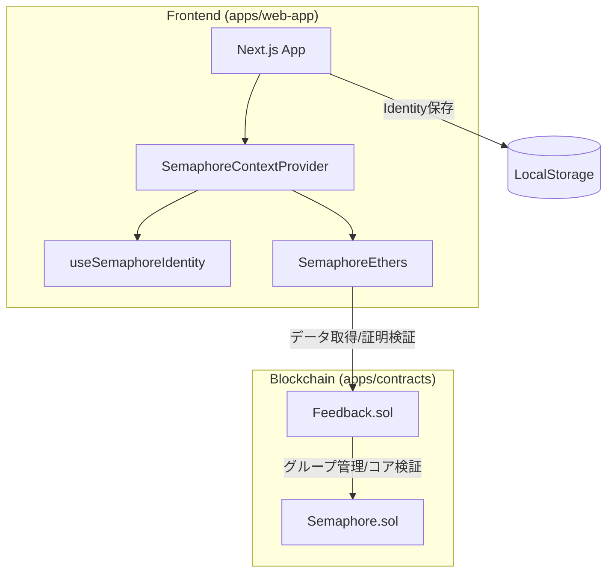
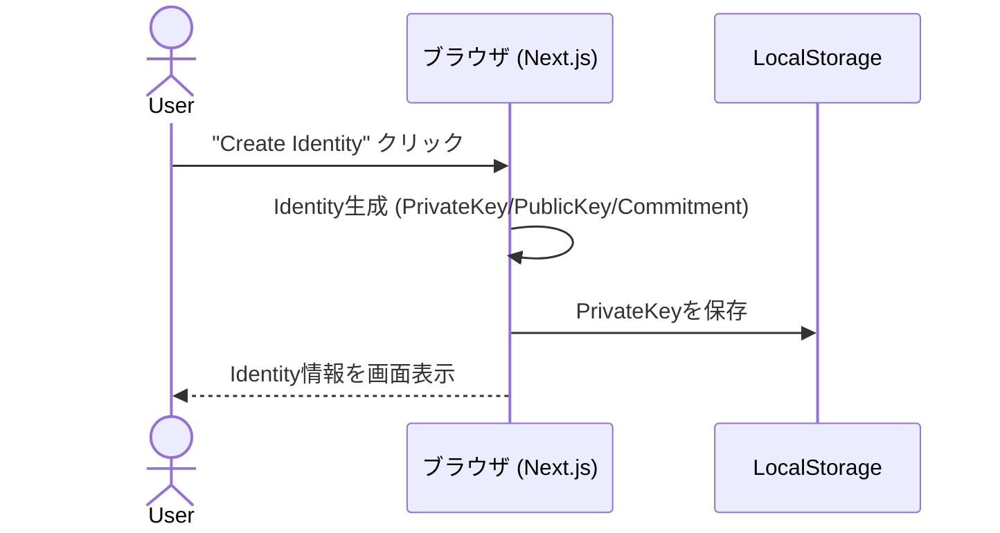
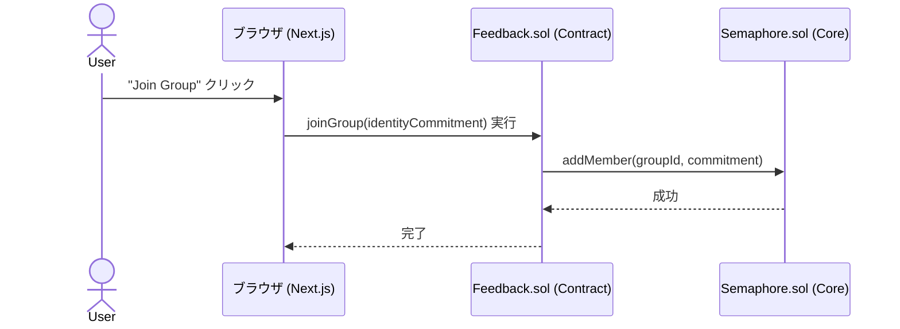
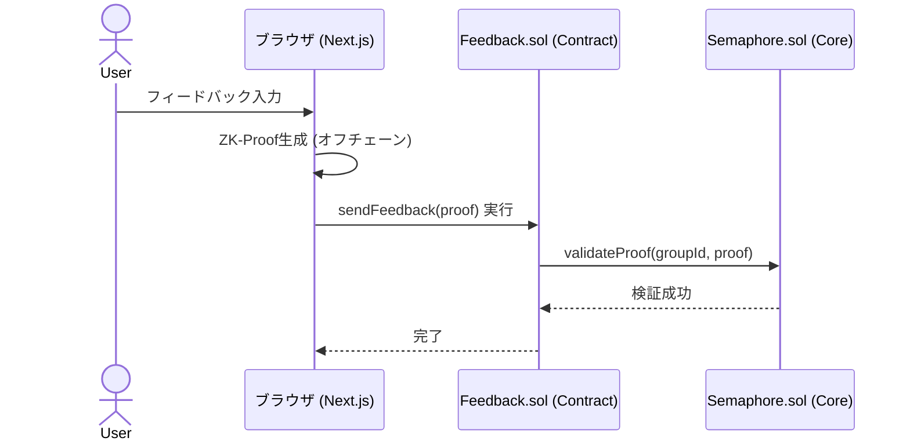

# Semaphore Hardhat + Next.js + SemaphoreEthers テンプレート

このプロジェクトは、Semaphoreプロトコルの基本的なユースケースを実証する完全なアプリケーションです。サンプルコントラクト、そのコントラクト用のテスト、およびデプロイ用のサンプルタスクが含まれています。また、コントラクトを操作するためのフロントエンドも含まれています。

## 🏗 システム構成



## 🔄 処理シーケンス

### 1. アイデンティティの生成



### 2. グループへの参加



### 3. 匿名フィードバックの送信



## 🧠 実装の詳細解説

### スマートコントラクト (`Feedback.sol`)

このプロジェクトの基盤となる `Feedback.sol` は、Semaphoreプロトコルの中継役（Relayer的な役割）を果たします。

1.  **グループの管理**:
    - `constructor` 内で `semaphore.createGroup()` を呼び出し、このアプリ専用の隔離されたメンバーシップグループを生成します。
    - 各グループは一意の `groupId` で識別され、オンチェーンのメルクルツリーによってメンバーの状態が管理されます。

2.  **メンバー登録 (`joinGroup`)**:
    - ユーザーの `identityCommitment`（公開識別子）を受け取り、Semaphoreコアコントラクトの `addMember` を実行します。
    - これにより、コントラクト上のメルクルツリーの葉（Leaf）に新しいメンバーが追加されます。

3.  **匿名証明の検証 (`sendFeedback`)**:
    - ユーザーは「自分がグループのメンバーであること」を、**自分のアイデンティティ（秘密鍵）を明かすことなく**証明します。
    - `semaphore.validateProof` を呼び出すことで、以下の項目をオンチェーンで検証します：
      - 送信された ZK-Proof が数学的に正しいこと。
      - その証明が現在のグループのメルクルツリー（Root）に基づいていること。
      - **Nullifier（無効化値）** をチェックし、同じ証明が二度使われていないこと（二重投票防止）。

### ゼロ知識証明（ZK）サーキット

Semaphoreプロトコルは内部で [Circom](https://iden3.io/circom) で記述されたZKサーキットを使用しています。主な検証ロジックは以下の3点です：

1.  **アイデンティティの証明 (Identity Integrity)**:
    - ユーザーが持っている秘密鍵（Secret）から生成された `identityCommitment` が、登録済みのものと一致することを証明します。
    - 秘密鍵自体はサーキットの「プライベート入力」として扱われ、外部（チェーン上）には一切漏洩しません。

2.  **グループ所属の証明 (Merkle Membership Proof)**:
    - `identityCommitment` がメルクルツリーの特定のインデックスに存在することを、メルクルパス（Merkle Path）を用いて証明します。
    - これにより「誰か特定の一人ではないが、グループの誰かである」という匿名性が担保されます。

3.  **二重送信防止 (Nullifier Hash)**:
    - 秘密鍵と外部公開値（External Nullifier / Scope）を組み合わせて、一意の `nullifierHash` を生成します。
    - ハッシュ関数の性質により、同じアイデンティティで同じスコープ（この場合はこのアプリ）に対して証明を生成すると、必ず同じ `nullifierHash` が算出されます。
    - コントラクトは使用済みの `nullifierHash` を記録することで、匿名性を維持したまま不正な二重送信をブロックします。

## 🛠 機能と技術スタック

### 提供している機能の一覧

| 機能カテゴリ             | 説明                                                                                    |
| ------------------------ | --------------------------------------------------------------------------------------- |
| **アイデンティティ管理** | Semaphoreアイデンティティ（秘密鍵・公開鍵・コミットメント）の生成、ブラウザ保存、復元。 |
| **グループ管理**         | コントラクト上でのSemaphoreグループの作成およびメンバー（コミットメント）の追加。       |
| **匿名証明と検証**       | ゼロ知識証明（ZK-Proof）のオフチェーン生成と、オンチェーンでの正当性検証。              |
| **ステート管理**         | React Contextを使用したメンバーリストおよび検証済みフィードバックの共有。               |

### 技術スタック

| カテゴリ                 | 使用技術                                      |
| ------------------------ | --------------------------------------------- |
| **モノレポ管理**         | Yarn Berry (v4)                               |
| **スマートコントラクト** | Solidity, Hardhat                             |
| **フロントエンド**       | Next.js (App Router), React, CSS Modules      |
| **ゼロ知識証明**         | Semaphore Protocol (@semaphore-protocol/core) |
| **クライアント通信**     | SemaphoreEthers, Ethers.js (v6)               |
| **静的解析・整形**       | ESLint, Prettier, Solhint                     |

## ⚙️ 環境変数のセットアップ

Sepolia などのテストネットワークで動作確認を行う場合、環境変数の設定が必要です。プロジェクトのルートディレクトリにある `.env.example` を `.env` にコピーして、必要な値を入力してください。

```bash
cp .env.example .env
```

### 必須の環境変数

| 変数名                                   | 説明                                                                      |
| :--------------------------------------- | :------------------------------------------------------------------------ |
| `DEFAULT_NETWORK`                        | 使用するネットワーク（例: `sepolia`, `hardhat`）。                        |
| `ETHEREUM_PRIVATE_KEY`                   | デプロイやトランザクション送信に使用するアカウントの秘密鍵。              |
| `INFURA_API_KEY`                         | Infura 経由でブロックチェーンに接続するための API キー。                  |
| `NEXT_PUBLIC_DEFAULT_NETWORK`            | フロントエンドが接続するネットワーク（通常は `DEFAULT_NETWORK` と同じ）。 |
| `NEXT_PUBLIC_INFURA_API_KEY`             | フロントエンドで使用する Infura API キー。                                |
| `NEXT_PUBLIC_SEMAPHORE_CONTRACT_ADDRESS` | 使用するネットワークでデプロイ済みの Semaphore コントラクトアドレス。     |
| `NEXT_PUBLIC_FEEDBACK_CONTRACT_ADDRESS`  | デプロイした `Feedback.sol` のコントラクトアドレス。                      |
| `NEXT_PUBLIC_GROUP_ID`                   | Semaphore グループの ID。                                                 |

### 任意の設定（リレイヤー/ガスレス送信）

ガスレス機能を試す場合は、以下の変数も設定してください。

- `GELATO_RELAYER_API_KEY`
- `NEXT_PUBLIC_GELATO_RELAYER_ENDPOINT`
- `NEXT_PUBLIC_GELATO_RELAYER_CHAIN_ID`

---

## 📜 使い方

### ローカルサーバー

以下のコマンドでアプリをローカルで起動できます：

```bash
yarn dev
```

### コントラクトのデプロイ

1. `apps/contracts` ディレクトリに移動し、コントラクトをデプロイします：

```bash
yarn deploy --semaphore <semaphore-address> --network sepolia
```

ネットワークごとのアドレスは以下のページから確認が可能

[Deployed contracts](https://docs.semaphore.pse.dev/deployed-contracts)

sepoliaの場合は以下のように実行する

```bash
yarn deploy --semaphore 0x8A1fd199516489B0Fb7153EB5f075cDAC83c693D --network sepolia
```

Verifyのためには以下のコマンドを実施する

```bash
yarn verify 0xA3aabaB53464eeD2BFEc0c77d5D8b110887cFA7F 0x8A1fd199516489B0Fb7153EB5f075cDAC83c693D --network sepolia
```

2. `apps/web-app/.env.production` ファイルを、新しいコントラクトアドレスとグループIDで更新します。

3. `apps/contracts/artifacts/contracts/` フォルダから `apps/web-app/contract-artifacts` フォルダへ、コントラクトのアーティファクトを手動でコピーします。

> [!NOTE]
> Semaphoreのコントラクトアドレスは [こちら](https://docs.semaphore.pse.dev/deployed-contracts) で確認できます。

### コードの品質とフォーマット

[ESLint](https://eslint.org/) と [solhint](https://github.com/protofire/solhint) を実行してコードを分析し、バグを検出します：

```bash
yarn lint
```

[Prettier](https://prettier.io/) を実行してフォーマット規則をチェックします：

```bash
yarn prettier
```

または、コードを自動的にフォーマットする場合：

```bash
yarn prettier:write
```
