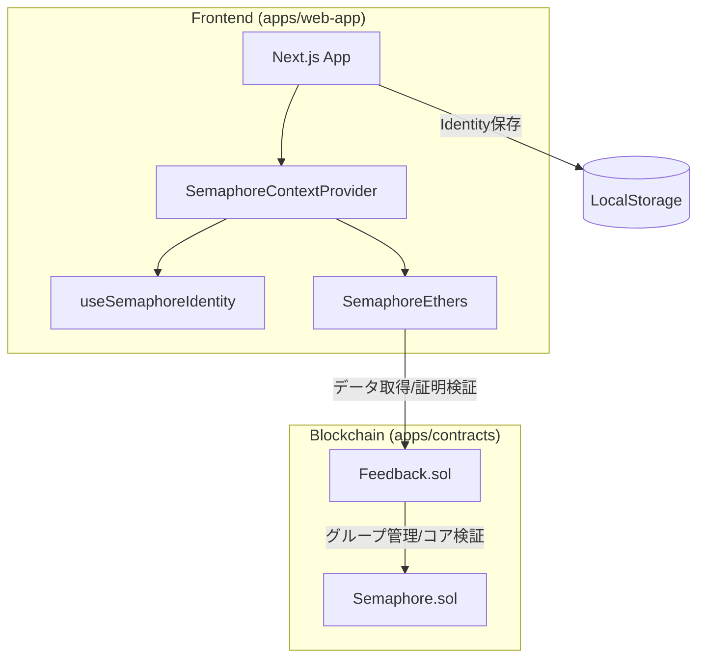
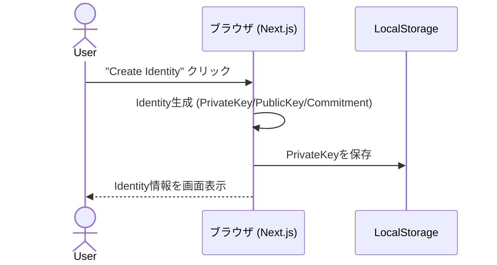
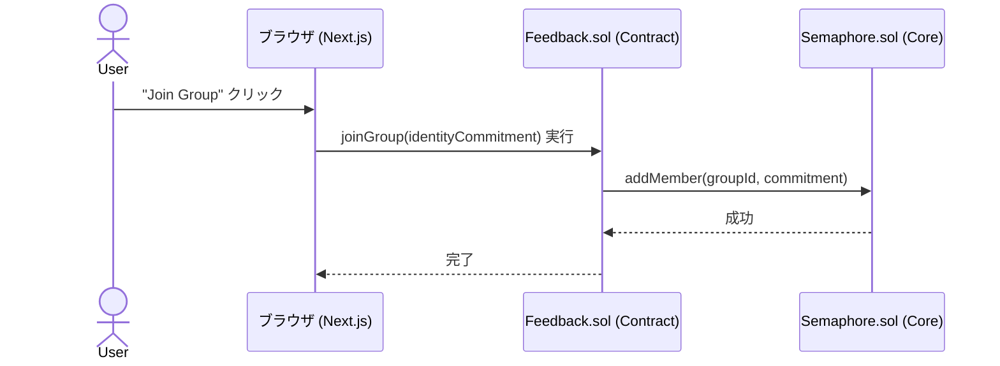
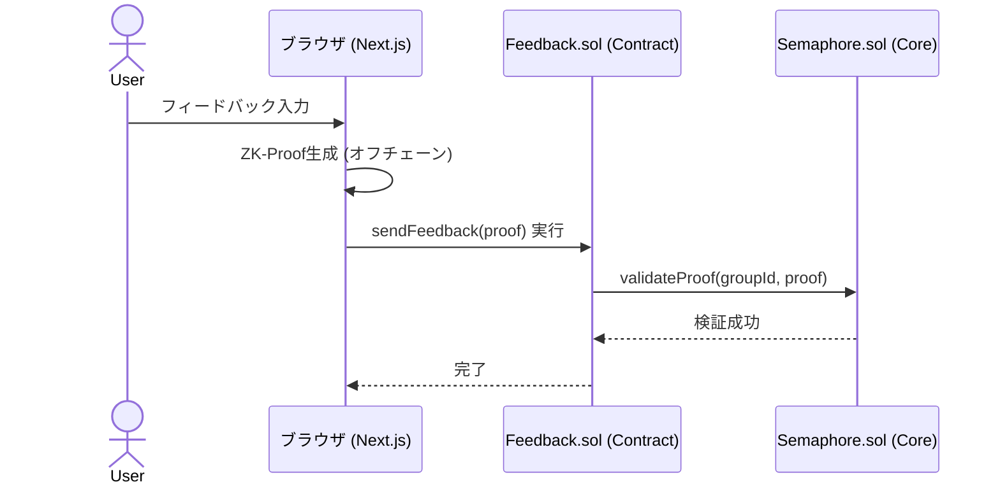

# Semaphore Hardhat + Next.js + SemaphoreEthers テンプレート

このプロジェクトは、Semaphoreプロトコルの基本的なユースケースを実証する完全なアプリケーションです。サンプルコントラクト、そのコントラクト用のテスト、およびデプロイ用のサンプルタスクが含まれています。また、コントラクトを操作するためのフロントエンドも含まれています。

## 🏗 システム構成



## 🔄 処理シーケンス

### 1. アイデンティティの生成



### 2. グループへの参加



### 3. 匿名フィードバックの送信



## 🧠 実装の詳細解説

### スマートコントラクト (`Feedback.sol`)

このプロジェクトの基盤となる `Feedback.sol` は、Semaphoreプロトコルの中継役（Relayer的な役割）を果たします。

1.  **グループの管理**:
    - `constructor` 内で `semaphore.createGroup()` を呼び出し、このアプリ専用の隔離されたメンバーシップグループを生成します。
    - 各グループは一意の `groupId` で識別され、オンチェーンのメルクルツリーによってメンバーの状態が管理されます。

2.  **メンバー登録 (`joinGroup`)**:
    - ユーザーの `identityCommitment`（公開識別子）を受け取り、Semaphoreコアコントラクトの `addMember` を実行します。
    - これにより、コントラクト上のメルクルツリーの葉（Leaf）に新しいメンバーが追加されます。

3.  **匿名証明の検証 (`sendFeedback`)**:
    - ユーザーは「自分がグループのメンバーであること」を、**自分のアイデンティティ（秘密鍵）を明かすことなく**証明します。
    - `semaphore.validateProof` を呼び出すことで、以下の項目をオンチェーンで検証します：
      - 送信された ZK-Proof が数学的に正しいこと。
      - その証明が現在のグループのメルクルツリー（Root）に基づいていること。
      - **Nullifier（無効化値）** をチェックし、同じ証明が二度使われていないこと（二重投票防止）。

### ゼロ知識証明（ZK）サーキット

Semaphoreプロトコルは内部で [Circom](https://iden3.io/circom) で記述されたZKサーキットを使用しています。主な検証ロジックは以下の3点です：

1.  **アイデンティティの証明 (Identity Integrity)**:
    - ユーザーが持っている秘密鍵（Secret）から生成された `identityCommitment` が、登録済みのものと一致することを証明します。
    - 秘密鍵自体はサーキットの「プライベート入力」として扱われ、外部（チェーン上）には一切漏洩しません。

2.  **グループ所属の証明 (Merkle Membership Proof)**:
    - `identityCommitment` がメルクルツリーの特定のインデックスに存在することを、メルクルパス（Merkle Path）を用いて証明します。
    - これにより「誰か特定の一人ではないが、グループの誰かである」という匿名性が担保されます。

3.  **二重送信防止 (Nullifier Hash)**:
    - 秘密鍵と外部公開値（External Nullifier / Scope）を組み合わせて、一意の `nullifierHash` を生成します。
    - ハッシュ関数の性質により、同じアイデンティティで同じスコープ（この場合はこのアプリ）に対して証明を生成すると、必ず同じ `nullifierHash` が算出されます。
    - コントラクトは使用済みの `nullifierHash` を記録することで、匿名性を維持したまま不正な二重送信をブロックします。

## 🛠 機能と技術スタック

### 提供している機能の一覧

| 機能カテゴリ             | 説明                                                                                    |
| ------------------------ | --------------------------------------------------------------------------------------- |
| **アイデンティティ管理** | Semaphoreアイデンティティ（秘密鍵・公開鍵・コミットメント）の生成、ブラウザ保存、復元。 |
| **グループ管理**         | コントラクト上でのSemaphoreグループの作成およびメンバー（コミットメント）の追加。       |
| **匿名証明と検証**       | ゼロ知識証明（ZK-Proof）のオフチェーン生成と、オンチェーンでの正当性検証。              |
| **ステート管理**         | React Contextを使用したメンバーリストおよび検証済みフィードバックの共有。               |

### 技術スタック

| カテゴリ                 | 使用技術                                      |
| ------------------------ | --------------------------------------------- |
| **モノレポ管理**         | Yarn Berry (v4)                               |
| **スマートコントラクト** | Solidity, Hardhat                             |
| **フロントエンド**       | Next.js (App Router), React, CSS Modules      |
| **ゼロ知識証明**         | Semaphore Protocol (@semaphore-protocol/core) |
| **クライアント通信**     | SemaphoreEthers, Ethers.js (v6)               |
| **静的解析・整形**       | ESLint, Prettier, Solhint                     |

## ⚙️ 環境変数のセットアップ

Sepolia などのテストネットワークで動作確認を行う場合、環境変数の設定が必要です。プロジェクトのルートディレクトリにある `.env.example` を `.env` にコピーして、必要な値を入力してください。

```bash
cp .env.example .env
```

### 必須の環境変数

| 変数名                                   | 説明                                                                      |
| :--------------------------------------- | :------------------------------------------------------------------------ |
| `DEFAULT_NETWORK`                        | 使用するネットワーク（例: `sepolia`, `baseSepolia`, `hardhat`）。        |
| `ETHEREUM_PRIVATE_KEY`                   | コントラクトデプロイに使用するアカウントの秘密鍵（contracts用）。         |
| `INFURA_API_KEY`                         | Infura 経由でブロックチェーンに接続するための API キー。                  |
| `NEXT_PUBLIC_DEFAULT_NETWORK`            | フロントエンドが接続するネットワーク（通常は `DEFAULT_NETWORK` と同じ）。 |
| `NEXT_PUBLIC_INFURA_API_KEY`             | フロントエンドで使用する Infura API キー。                                |
| `NEXT_PUBLIC_SEMAPHORE_CONTRACT_ADDRESS` | 使用するネットワークでデプロイ済みの Semaphore コントラクトアドレス。     |
| `NEXT_PUBLIC_FEEDBACK_CONTRACT_ADDRESS`  | デプロイした `Feedback.sol` のコントラクトアドレス。                      |
| `NEXT_PUBLIC_GROUP_ID`                   | Semaphore グループの ID。                                                 |
| `NEXT_PUBLIC_PRIVY_APP_ID`               | Privy 認証に使用する App ID（web-app用）。                               |
| `NEXT_PUBLIC_BICONOMY_BUNDLER_API_KEY`   | Biconomy Bundler API キー（web-app用）。                                 |
| `NEXT_PUBLIC_BICONOMY_PAYMASTER_API_KEY` | Biconomy Paymaster API キー（web-app用）。                               |
| `NEXT_PUBLIC_SUPABASE_URL`               | Supabase プロジェクト URL（アイデンティティ保存用）。                    |
| `NEXT_PUBLIC_SUPABASE_ANON_KEY`          | Supabase 匿名キー（クライアントサイドアクセス用）。                       |

---

## 🔐 外部サービスのセットアップ

web-appはAccount Abstraction（AA）によるガスレストランザクションを実装しています。以下の外部サービスの設定が必要です。

### Privy Console の設定

[Privy](https://privy.io/)はWeb2ライクな認証体験を提供するサービスです。

1. **アカウント作成**
   - [Privy Dashboard](https://dashboard.privy.io/)にアクセスし、アカウントを作成

2. **アプリケーション作成**
   - 「Create App」をクリックして新しいアプリケーションを作成
   - アプリ名を入力（例: "Semaphore Feedback App"）

3. **ログイン方法の設定**
   - 左メニューから「Login methods」を選択
   - 以下の認証方法を有効化:
     - ✅ Email
     - ✅ Wallet
     - ✅ Google

4. **エンベデッドウォレットの設定**
   - 左メニューから「Embedded Wallets」を選択
   - 「Ethereum」を有効化
   - 「Create on login」を`users-without-wallets`に設定

5. **サポートチェーンの追加**
   - 左メニューから「Networks」を選択
   - 「Base Sepolia (84532)」を追加

6. **App IDの取得**
   - ダッシュボードの「Settings」から`App ID`をコピー
   - `.env`ファイルの`NEXT_PUBLIC_PRIVY_APP_ID`に設定

### Biconomy Dashboard の設定

[Biconomy](https://biconomy.io/)はAccount Abstraction（ERC-4337）を実装するためのインフラです。

#### 1. Paymasterの作成

1. **アカウント作成**
   - [Biconomy Dashboard](https://dashboard.biconomy.io/)にアクセスし、アカウントを作成

2. **Paymasterの作成**
   - 左メニューから「Paymasters」を選択
   - 「Create Paymaster」をクリック
   - ネットワーク: `Base Sepolia`を選択
   - Paymaster名を入力（例: "Feedback Paymaster"）

3. **Paymaster URLとAPIキーの取得**
   - 作成したPaymasterの詳細ページから以下をコピー:
     - `Paymaster URL`: `.env`の`NEXT_PUBLIC_BICONOMY_PAYMASTER_URL`に設定（※現在未使用、将来の拡張用）
     - `API Key`: `.env`の`NEXT_PUBLIC_BICONOMY_PAYMASTER_API_KEY`に設定

4. **Gas Tankへの資金供給**
   - Paymasterページの「Gas Tank」タブを選択
   - 「Deposit」ボタンをクリック
   - Base Sepolia ETHを入金（テスト用に0.01 ETH程度）
   - **重要**: Gas Tankが空の場合、ガスレストランザクションは失敗します

5. **ポリシー設定（Contract Whitelisting）**
   - 「Policies」タブを選択
   - 「Add Contract Address」をクリック
   - Feedbackコントラクトアドレスを追加: `0x521a4A2D9A6542A1a578ecF362B8CBeE4Ef46e02`
   - 「Whitelisted Methods」で以下のメソッドを許可:
     - `joinGroup(uint256)`
     - `sendFeedback(uint256,uint256,uint256,bytes32,uint256[8])`

#### 2. Bundlerの設定

1. **Bundler APIキーの取得**
   - 左メニューから「Bundlers」を選択
   - 「Base Sepolia」のBundler URLとAPI Keyを確認
   - `API Key`: `.env`の`NEXT_PUBLIC_BICONOMY_BUNDLER_API_KEY`に設定
   - `Bundler URL`: `.env`の`NEXT_PUBLIC_BICONOMY_BUNDLER_URL`に設定（※現在未使用、将来の拡張用）

### Supabase の設定（アイデンティティ保存用）

1. **プロジェクト作成**
   - [Supabase](https://supabase.com/)でプロジェクトを作成

2. **identitiesテーブルの作成**
   - SQL Editorで以下のクエリを実行:
   ```sql
   CREATE TABLE identities (
     user_id TEXT PRIMARY KEY,
     private_key TEXT NOT NULL,
     commitment TEXT NOT NULL,
     updated_at TIMESTAMP NOT NULL DEFAULT NOW()
   );

   -- Row Level Security (RLS) を有効化（推奨）
   ALTER TABLE identities ENABLE ROW LEVEL SECURITY;

   CREATE POLICY "Users can only access their own identity"
   ON identities FOR ALL
   USING (user_id = auth.uid());
   ```

3. **環境変数の設定**
   - Supabase Dashboard の「Settings」→「API」から以下をコピー:
     - `Project URL`: `.env`の`NEXT_PUBLIC_SUPABASE_URL`に設定
     - `anon public`: `.env`の`NEXT_PUBLIC_SUPABASE_ANON_KEY`に設定

---

## 🔄 aa-gasless-sampleとの主要な違い

このプロジェクトは[aa-gasless-sample](https://github.com/yourusername/aa-gasless-sample)をベースにしていますが、Semaphoreプロトコルの匿名証明機能を統合するため、以下の点で異なります。

### アーキテクチャの違い

| 項目 | aa-gasless-sample | このプロジェクト（Semaphore統合） |
|------|-------------------|----------------------------------|
| **主要機能** | シンプルなカウンター操作 | 匿名フィードバック送信 + グループ管理 |
| **コントラクト** | `Counter.sol` | `Feedback.sol` + `Semaphore.sol` |
| **アイデンティティ管理** | なし（ウォレットアドレスのみ） | Semaphore Identity（秘密鍵・コミットメント） |
| **データ永続化** | なし | Supabase（アイデンティティ保存） |
| **証明生成** | なし | ZK-Proof生成（オフチェーン） |
| **プライバシー保護** | なし | Nullifierベースの匿名性保証 |

### 技術スタックの違い

#### 1. コントラクト層の拡張

**aa-gasless-sample:**
```solidity
contract Counter {
    uint256 public count;
    function increment() public {
        count += 1;
    }
}
```

**このプロジェクト:**
```solidity
contract Feedback {
    ISemaphore public semaphore;
    uint256 public groupId;
    
    // グループ参加（メルクルツリーへの追加）
    function joinGroup(uint256 identityCommitment) external {
        semaphore.addMember(groupId, identityCommitment);
    }
    
    // 匿名証明の検証
    function sendFeedback(
        uint256 merkleTreeDepth,
        uint256 merkleTreeRoot,
        uint256 nullifier,
        bytes32 feedback,
        uint256[8] calldata points
    ) external {
        semaphore.validateProof(groupId, ISemaphore.SemaphoreProof({
            merkleTreeDepth: merkleTreeDepth,
            merkleTreeRoot: merkleTreeRoot,
            nullifier: nullifier,
            message: uint256(feedback),
            points: points
        }));
        // ...
    }
}
```

#### 2. フロントエンドの状態管理

**aa-gasless-sample:**
- シンプルな useState のみ
- カウンター値の読み取り/更新

**このプロジェクト:**
- **SemaphoreContext**: グループメンバーとフィードバックの管理
- **AuthContext**: Privy認証状態の管理
- **useSemaphoreIdentity**: アイデンティティの生成・復元
- **useBiconomy**: スマートアカウントとトランザクション送信

#### 3. アイデンティティライフサイクル

**aa-gasless-sample:**
```typescript
// Privyの埋め込みウォレットをそのまま使用
const { user } = usePrivy();
const walletAddress = user?.wallet?.address;
```

**このプロジェクト:**
```typescript
// Semaphore Identityの生成と永続化
import { Identity } from "@semaphore-protocol/core";

// 1. アイデンティティ生成
const identity = new Identity();
const privateKey = identity.export();

// 2. Supabaseに保存
await supabase.from("identities").upsert({
  user_id: user.id,
  private_key: privateKey,
  commitment: identity.commitment.toString()
});

// 3. 復元
const { data } = await supabase
  .from("identities")
  .select("private_key")
  .eq("user_id", user.id)
  .single();
const restoredIdentity = new Identity(data.private_key);
```

#### 4. トランザクション送信の複雑性

**aa-gasless-sample:**
```typescript
// シンプルなカウンターインクリメント
const functionCallData = encodeFunctionData({
  abi: CounterAbi,
  functionName: "increment",
  args: []
});

await sendTransaction(counterAddress, functionCallData);
```

**このプロジェクト:**
```typescript
// ZK-Proof生成 + 証明パラメータのエンコード
import { generateProof } from "@semaphore-protocol/proof";

// 1. オフチェーンで証明を生成（ブラウザ内）
const proof = await generateProof(identity, group, message, scope);

// 2. 証明パラメータをエンコード
const functionCallData = encodeFunctionData({
  abi: FeedbackAbi,
  functionName: "sendFeedback",
  args: [
    proof.merkleTreeDepth,
    proof.merkleTreeRoot,
    proof.nullifier,
    ethers.encodeBytes32String(feedback),
    proof.points
  ]
});

// 3. Biconomy経由で送信
await sendTransaction(feedbackAddress, functionCallData);
```

### 依存関係の違い

**このプロジェクトで追加されたライブラリ:**
```json
{
  "@semaphore-protocol/core": "^4.x",
  "@semaphore-protocol/proof": "^4.x",
  "@supabase/supabase-js": "^2.x"
}
```

### ユースケースの違い

| aa-gasless-sample | このプロジェクト |
|-------------------|------------------|
| AAの基本的なデモ | プライバシー保護が必要なアプリケーション（投票、匿名フィードバック、Whistleblowing等） |
| 学習目的 | 実用的なゼロ知識証明アプリケーション |
| シンプルな状態更新 | グループメンバーシップ証明 + 匿名アクション |

### まとめ

aa-gasless-sampleは「Account Abstractionの基本動作確認」を目的としたシンプルなテンプレートですが、このプロジェクトは以下の点で実用的なアプリケーションに近づけています：

- ✅ **プライバシー保護**: Semaphoreプロトコルによる匿名性保証
- ✅ **アイデンティティ管理**: 秘密鍵の安全な保存・復元機構
- ✅ **複雑な証明ロジック**: ZK-Proofの生成と検証
- ✅ **状態管理の実装**: React Contextによる複数コンポーネント間のデータ共有
- ✅ **エラーハンドリング**: Paymaster失敗、証明エラー等の適切な処理

これにより、AAの利便性（ガスレス）とZKPのプライバシー保護を組み合わせた、次世代のdAppアーキテクチャを学ぶことができます。

---

## 📜 使い方

### ローカルサーバー

以下のコマンドでアプリをローカルで起動できます：

```bash
yarn dev
```

### コントラクトのデプロイ

1. `apps/contracts` ディレクトリに移動し、コントラクトをデプロイします：

```bash
yarn deploy --semaphore <semaphore-address> --network sepolia
```

ネットワークごとのアドレスは以下のページから確認が可能

[Deployed contracts](https://docs.semaphore.pse.dev/deployed-contracts)

#### Sepoliaの場合

```bash
yarn contracts deploy --semaphore 0x8A1fd199516489B0Fb7153EB5f075cDAC83c693D --network sepolia
```

Verifyのためには以下のコマンドを実施する

```bash
yarn contracts verify 0xA3aabaB53464eeD2BFEc0c77d5D8b110887cFA7F 0x8A1fd199516489B0Fb7153EB5f075cDAC83c693D --network sepolia
```

#### Base Sepoliaの場合

```bash
yarn contracts deploy --semaphore 0x8A1fd199516489B0Fb7153EB5f075cDAC83c693D --network baseSepolia
```

Verifyのためには以下のコマンドを実施する

```bash
yarn contracts verify 0xeA114004087c6b32BeeaAAc1f68f5C5bdc77b350 0x8A1fd199516489B0Fb7153EB5f075cDAC83c693D --network baseSepolia
```

2. `apps/web-app/.env.production` ファイルを、新しいコントラクトアドレスとグループIDで更新します。

3. `apps/contracts/artifacts/contracts/` フォルダから `apps/web-app/contract-artifacts` フォルダへ、コントラクトのアーティファクトを手動でコピーします。

> [!NOTE]
> Semaphoreのコントラクトアドレスは [こちら](https://docs.semaphore.pse.dev/deployed-contracts) で確認できます。

### コードの品質とフォーマット

[ESLint](https://eslint.org/) と [solhint](https://github.com/protofire/solhint) を実行してコードを分析し、バグを検出します：

```bash
yarn lint
```

[Prettier](https://prettier.io/) を実行してフォーマット規則をチェックします：

```bash
yarn prettier
```

または、コードを自動的にフォーマットする場合：

```bash
yarn prettier:write
```
